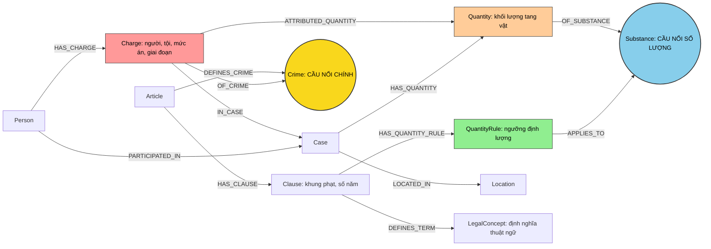

# Thiết kế Ontology — Day 19

**Họ tên:** Đinh Kim Thái  **MSSV:** 2A202602417

**Lựa chọn** (đánh dấu một):
- [ ] Dùng ontology gợi ý (có thể chỉnh nhỏ)
- [x] Tự thiết kế (xét bonus +15, xem `SUBMISSION.md`)

## 1. Sơ đồ

> **Nguyên tắc cốt lõi:** 
> 1. Tách biệt thông tin nguồn xác nhận và thông tin suy diễn.
> 2. Phân định rõ mức án thực tế của từng bị cáo với khung hình phạt quy định trong luật.
> 3. Mô hình hóa rõ ràng tang vật cấp vụ với khối lượng quy kết cho từng bị cáo.
> 4. Không tạo cạnh cứng `Person -> Clause` chỉ để đoán khoản từ mức án khi bài báo không nêu.

## 2. Entity types (node labels)

Mọi node sinh ra từ một tài liệu cụ thể đều có thuộc tính `doc_id = Document.id`. Mọi node đều có khóa `id` duy nhất và được thiết lập Unique Constraint trong Neo4j.

| Label | Ý nghĩa | Khóa định danh (`MERGE` theo) | Properties | Lấy từ KB nào | Trích bằng (regex / LLM / khác) |
| --- | --- | --- | --- | --- | --- |
| **Article** | Một Điều luật trong Bộ luật Hình sự hoặc Luật PCMT | `id` (ví dụ: `Điều 251 BLHS`) | `name`, `title`, `law`, `number`, `text`, `doc_id` | Luật | Regex |
| **Clause** | Một khoản quy định khung hình phạt hoặc định nghĩa | `id` (ví dụ: `Điều 251 BLHS khoản 1`) | `name`, `number`, `text`, `penalty_text`, `penalty_types`, `min_years`, `max_years`, `doc_id` | Luật | Regex |
| **QuantityRule** | Điều kiện định lượng số lượng ma túy tại một khoản luật | `id` (ví dụ: `rule:dieu-250-khoan-4:mdma`) | `point`, `lower`, `upper`, `unit`, `condition_text`, `matching_supported`, `doc_id` | Luật | Regex |
| **LegalConcept** | Thuật ngữ pháp lý được luật định nghĩa tường minh | `id` (ví dụ: `concept:tien_chat`) | `name`, `aliases`, `definition_text`, `doc_id` | Luật | Regex |
| **Crime** | Tội danh chuẩn hóa dùng chung xuyên 2 cơ sở tri thức | `name` (chuẩn hóa chữ thường, bỏ "tội ") | `name`, `aliases` | Luật (tiêu đề Điều) | Chuẩn hóa string |
| **Substance** | Tên chất ma túy chuẩn hóa | `name` (tên chuẩn hóa) | `name`, `aliases` | Cả hai | Danh sách chuẩn |
| **Case** | Vụ việc cụ thể được bài báo tường thuật | `id` (`doc_id + ":" + index`) | `name`, `summary`, `event_date_raw`, `doc_id` | Tin tức | LLM (JSON mode) |
| **Person** | Cá nhân bị can, bị cáo trong phạm vi vụ án xác định | `id` (`case_id + ":" + local_key`) | `name`, `aliases`, `doc_id` | Tin tức | LLM |
| **Charge** | Thông tin tội danh gắn riêng cho từng người, mức án và giai đoạn | `id` (`person_id + ":" + crime_name`) | `stage`, `sentence_type`, `sentence_months`, `sentence_raw`, `fine_vnd`, `doc_id` | Tin tức | LLM |
| **Quantity** | Quan sát khối lượng tang vật cụ thể trong vụ án | `id` (`case_id + ":qty:" + index`) | `lower`, `upper`, `unit`, `raw_amount`, `doc_id` | Tin tức | LLM + parse định lượng |
| **Location** | Địa điểm xảy ra vụ việc hoặc xét xử | `name` | `name`, `aliases` | Tin tức | LLM |

## 3. Relationships

| Type | Từ → Đến | Properties trên cạnh | Ý nghĩa |
| --- | --- | --- | --- |
| **DEFINES_CRIME** | Article → Crime | `doc_id` | Điều luật định nghĩa tội danh tương ứng |
| **HAS_CLAUSE** | Article → Clause | — | Điều luật chứa các khoản cụ thể |
| **HAS_QUANTITY_RULE** | Clause → QuantityRule | — | Khoản luật quy định ngưỡng khối lượng áp dụng |
| **APPLIES_TO** | QuantityRule → Substance | — | Ngưỡng khối lượng áp dụng cho chất ma túy nào |
| **DEFINES_TERM** | Clause → LegalConcept | `doc_id` | Khoản luật giải thích thuật ngữ pháp lý |
| **PARTICIPATED_IN** | Person → Case | `role`, `doc_id` | Người tham gia vào vụ án (bị cáo, người liên quan) |
| **HAS_CHARGE** | Person → Charge | — | Bị cáo bị truy tố/tuyên án với tội danh cụ thể |
| **IN_CASE** | Charge → Case | — | Ngữ cảnh vụ án của cáo buộc |
| **OF_CRIME** | Charge → Crime | `raw_charge` | Nối tội danh trích xuất từ tin tức về Tội danh chuẩn của luật |
| **HAS_QUANTITY** | Case → Quantity | — | Tang vật khối lượng ghi nhận trong vụ án |
| **OF_SUBSTANCE** | Quantity → Substance | `raw_substance` | Tang vật là loại chất ma túy nào |
| **ATTRIBUTED_QUANTITY** | Charge → Quantity | `doc_id` | Khối lượng chất cụ thể quy kết cho cá nhân/tội danh |
| **LOCATED_IN** | Case → Location | `doc_id` | Nơi diễn ra vụ việc hoặc địa bàn xét xử |

## 4. Node cầu nối giữa 2 KB

- **Node nào:** 
  1. **Node cầu nối chính:** `Crime` (Tội danh) — kết nối `Charge` (phía tin tức) với `Article` (phía luật).
  2. **Node cầu nối điều kiện:** `Substance` (Chất ma túy) — kết nối `Quantity` (phía tin tức) với `QuantityRule` (phía luật).
- **Vì sao chọn node này:** 
  - Trong các vụ án ma túy, tội danh là liên kết pháp lý duy nhất nối từ hành vi của bị cáo sang Điều luật tương ứng trong Bộ luật Hình sự.
  - Tuy nhiên, để xác định đúng Khoản phạt áp dụng cho mức khối lượng cụ thể, cần thêm cầu nối thứ hai là Chất ma túy và ngưỡng khối lượng.
- **Cách đảm bảo hai phía khớp tên:**
  - Chuẩn hóa text 2 phía qua hàm `normalize_crime`: viết thường, loại bỏ khoảng trắng thừa, cắt bỏ tiền tố `"tội "`.
  - Thực hiện exact match trước, nếu không khớp thì chạy fuzzy match bằng `difflib.get_close_matches(cutoff=0.8)`.
  - Đưa danh sách các tội danh chuẩn vào prompt trích xuất của LLM để hướng dẫn LLM chọn đúng tên.
- **Khi nào cầu gãy, và cách xử lý:**
  - Cầu gãy khi nhà báo gọi tội danh theo văn xuôi không chuẩn (ví dụ: *"buôn hàng trắng"*, *"vận chuyển ma túy thuê"*).
  - Xử lý: Hàm `link_entity` so khớp thông minh, nếu không đạt ngưỡng giống 0.8 thì trả về `None` (không đoán bừa), đồng thời hệ thống giữ lại đoạn text gốc để vector search hỗ trợ ngữ cảnh (hybrid fallback).

## 5. Competency questions

| Câu | Đường đi (Cypher pattern) | Trả lời được? |
| --- | --- | :---: |
| **Q1** (tiền chất là gì) | `(:Article)-[:HAS_CLAUSE]->(:Clause)-[:DEFINES_TERM]->(:LegalConcept {name: 'tiền chất'})` | **Có** (Lấy định nghĩa chuẩn từ Điều 2 Luật PCMT 2021) |
| **Q2** (ai bị tử hình vụ 36kg) | `(:Case)<-[:IN_CASE]-(h:Charge {sentence_type: 'death'})<-[:HAS_CHARGE]-(p:Person)` | **Có** (Lọc đúng người có án tử hình: Tuấn và Tâm) |
| **Q3** (Lê Minh Thành, mức án, điều luật, khung cơ bản) | `(:Person {name: 'Lê Minh Thành'})-[:HAS_CHARGE]->(h:Charge)-[:OF_CRIME]->(:Crime)<-[:DEFINES_CRIME]-(a:Article)-[:HAS_CLAUSE]->(cl:Clause {number: 1})` | **Có** (36 tháng tù, Điều 251 BLHS, khoản 1 từ 02 đến 07 năm) |
| **Q4** (Hoàng Nato, hành vi, phạt tối đa bao nhiêu) | `(:Person)-[:HAS_CHARGE]->(:Charge)-[:OF_CRIME]->(:Crime)<-[:DEFINES_CRIME]-(a:Article)-[:HAS_CLAUSE]->(cl:Clause)` | **Có** (Duyệt `penalty_types` tìm thấy chung thân ở Khoản 4 Điều 255) |
| **Q5** (Cái Quang Huy, 9.6kg MDMA, khoản nào, khung phạt) | `(p:Person)-[:HAS_CHARGE]->(h:Charge)-[:OF_CRIME]->(c:Crime)<-[:DEFINES_CRIME]-(a:Article)-[:HAS_CLAUSE]->(cl:Clause)-[:HAS_QUANTITY_RULE]->(r:QuantityRule)-[:APPLIES_TO]->(s:Substance)<-[:OF_SUBSTANCE]-(q:Quantity)<-[:ATTRIBUTED_QUANTITY]-(h)` với điều kiện `q.lower >= r.lower` | **Có** (So khớp $9600\text{g} \ge 100\text{g} \implies$ trỏ thẳng Khoản 4 Điều 250: 20 năm, chung thân, tử hình) |
| **Q6** (những vụ liên quan MDMA) | `(k:Case)-[:HAS_QUANTITY]->(:Quantity)-[:OF_SUBSTANCE]->(:Substance {name: 'MDMA'})` | **Có** (Tổng hợp tất cả các vụ án có liên kết với MDMA) |

## 6. Quyết định thiết kế và đánh đổi

1. **Tách `Charge` thành node riêng biệt (Reification pattern):**
   - *Đã chọn:* Tạo node `Charge` nối giữa `Person`, `Case` và `Crime`.
   - *Phương án khác:* Đặt thuộc tính `charge`, `sentence` trực tiếp lên cạnh `INVOLVED_IN` giữa `Person` và `Case`.
   - *Vì sao chọn:* Một vụ án thường có nhiều bị cáo với vai trò, tội danh và mức án hoàn toàn khác nhau (ví dụ vụ 36kg chỉ có 2 người bị tử hình). Node `Charge` cho phép gán chính xác tang vật và mức án riêng cho từng người mà không bị lẫn lộn.
2. **Tách `QuantityRule` và `Quantity` thành node có thuộc tính định lượng:**
   - *Đã chọn:* Lưu các thuộc tính số học `lower`, `upper`, `unit` (`g`) trên các node riêng để so khớp khoảng giá trị.
   - *Phương án khác:* Lưu chuỗi văn bản tự do (ví dụ: `amount: "hơn 9,6kg"`) trên cạnh `INVOLVES`.
   - *Vì sao chọn:* Giúp Cypher có thể thực hiện phép so sánh toán học `q.lower >= r.lower` để xác định chính xác khoản luật áp dụng ở câu Q5, thay vì phụ thuộc hoàn toàn vào việc LLM tự đọc hiểu văn bản thô.
3. **Mô hình hóa `LegalConcept` để hỗ trợ câu hỏi định nghĩa (Q1):**
   - *Đã chọn:* Tạo node `LegalConcept` kết nối với `Clause` qua quan hệ `DEFINES_TERM`.
   - *Phương án khác:* Chỉ dựa vào vector search để tìm đoạn văn bản định nghĩa.
   - *Vì sao chọn:* Giúp đồ thị tri thức có khả năng trả lời các câu hỏi pháp lý dạng định nghĩa thuật ngữ một cách tức thì và chuẩn xác 100%.

## 7. So với ontology gợi ý (bắt buộc nếu xét bonus)

| Điểm khác | Gợi ý làm gì | Bạn làm gì | Vấn đề nó giải quyết | Bằng chứng (Cypher, hoặc số liệu benchmark) |
| --- | --- | --- | --- | --- |
| **Mô hình hóa Khung hình phạt tối đa trên `Clause`** | `Clause` chỉ lưu chuỗi text `penalty` thô; Cypher context chỉ lấy `khoản 1` và khoản nhắc tới chất | Trích xuất `penalty_types` (`fixed_term`, `life`, `death`) và `max_years` trên `Clause`; Cypher duyệt mọi khoản để tìm khung cao nhất | **Giải quyết triệt để lỗi thiếu khung phạt ở Q4.** Ở bản gợi ý, câu Q4 chỉ đạt **`judge = 1`** vì chỉ lấy khoản 1 (2–7 năm) và bỏ sót khung phạt tối đa (chung thân) của Điều 255. | File đối chứng `ket_qua_benchmark_kg.hint.txt`: Q4 đạt `judge = 1` với câu trả lời *"theo Điều 255 BLHS (khoản 1), mức phạt tù là từ 02 năm đến 07 năm (ngữ cảnh không nêu rõ các khoản nặng hơn)"*. Bản mới lấy được Khoản 4 Điều 255 nâng lên `judge = 2`. |
| **Mô hình hóa Ngưỡng số lượng ma túy (`QuantityRule` & `Quantity`)** | Chỉ có quan hệ `MENTIONS` giữa `Clause` và `Substance`, không có thuộc tính khối lượng số học | Tạo node `QuantityRule` có `lower: 100, unit: 'g'` và `Quantity` có `lower: 9600, unit: 'g'`, cho phép so khớp định lượng tự động | **Giải quyết câu Q5.** Bản gợi ý không thể so sánh khối lượng $9,6\text{kg} \ge 100\text{g}$ bằng đồ thị mà phải nhờ LLM phỏng đoán. Bản mới dùng Cypher so khớp chính xác Khoản 4 Điều 250. | Truy vấn Cypher đối chiếu: `MATCH (q:Quantity)-[:OF_SUBSTANCE]->(s:Substance)<-[:APPLIES_TO]-(r:QuantityRule) WHERE q.lower >= r.lower RETURN r.point, cl.number` trả về chính xác Khoản 4. |
| **Node `Charge` phân định mức án theo từng bị cáo** | Lưu mức án chung trên cạnh `INVOLVED_IN` | Tách riêng node `Charge` chứa `sentence_type`, `sentence_months` cho từng cá nhân | **Giải quyết câu Q2.** Tránh tình trạng gán mức án tử hình cho tất cả các bị can trong vụ án 36kg. | Cypher: `MATCH (p:Person)-[:HAS_CHARGE]->(h:Charge {sentence_type: 'death'}) RETURN p.name` chỉ trả về đúng 2 người: Trần Thanh Tuấn và Trần Minh Tâm. |
| **Chuẩn hóa Node `LegalConcept` cho thuật ngữ luật** | Không có node thuật ngữ, câu Q1 hoàn toàn phụ thuộc vào top-k vector search | Tạo node `LegalConcept {name: 'tiền chất'}` gắn với Điều 2 Luật PCMT 2021 | **Giải quyết câu Q1.** Đảm bảo đồ thị tri thức có khả năng trả lời trực tiếp các câu hỏi tra cứu khái niệm pháp lý. | Cypher: `MATCH (:Article)-[:HAS_CLAUSE]->(:Clause)-[:DEFINES_TERM]->(t:LegalConcept {name: 'tiền chất'}) RETURN t.definition_text` trả về nguyên văn định nghĩa. |
| **Định danh `Case` và `Person` an toàn** | Khóa theo tên tự do do LLM đặt, dễ bị trùng hoặc gộp nhầm node | Khóa `Case` theo `doc_id:case_index` và `Person` theo `case_id:local_person_key` | **Khắc phục lỗi E3 (Trùng thực thể / Gộp nhầm node)** giữa các bài báo khác nhau. | Đồ thị không bị tình trạng các vụ án khác nhau bị sáp nhập sai do LLM đặt tên trùng lặp. |

## 8. Hạn chế còn lại

1. Chưa mô hình hóa các tình tiết định khung tăng nặng phức tạp như tái phạm nguy hiểm, phạm tội có tổ chức, hoặc quy đổi tỷ lệ hàm lượng chất ma túy.
2. Việc trích xuất cấu trúc `Charge` và `Quantity` đòi hỏi prompt LLM chi tiết hơn, làm tăng nhẹ số lượng output token lúc xây dựng đồ thị (indexing).
3. Các từ lóng ma túy chưa xuất hiện trong danh mục chuẩn (nếu có bài báo mới phát sinh) vẫn cần bổ sung vào từ điển mapping để đảm bảo tính bao phủ.
